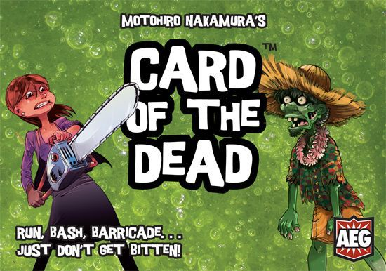

Card of the Dead
================

AEG' Card of the Dead board game implementation in Kotlin.

This project was a nice brain exercise, partially initiated to cope with a growing anxiety during 
difficult times and partially to try a new field. It's written in Kotlin with bits of 
[RxJava]/[RxKotlin] and [Kotest]/[MockK] for tests. At the very first 
[0.1](https://github.com/kndykndy/CardOfTheDead/releases/tag/0.1) version there's a 
console client implementation only (barely playable, tbh), with a firm plan to release a 
full-blown UI [TornadoFX]-based client in a future release.

Original game credits
---------------------

The original board game was created by designer **Motohiro Nakamura** and artist **Loïc Billiau**, 
and published by [AEG] (abandoned link) in 2013. Game [rulesheet](./assets/Rulesheet.pdf) is put 
within assets, and you can find more about the game 
[here](https://boardgamegeek.com/boardgame/129469/card-dead).

Installation
------------

**Java 8 is required** to run current releases. Building and running using newer Java versions is
not guaranteed.

To run the game from binary:
 - download [CardOfTheDead-0.1](https://github.com/kndykndy/CardOfTheDead/releases/tag/0.1)
 - from the download folder run `java -jar ./CardOfTheDead-0.1.jar`

Building
--------

Prerequisites are git and Java 8 in order to build *Card of the Dead* form sources.

To build and run the game from sources:
 - clone the official repo with `git clone https://github.com/kndykndy/CardOfTheDead.git`
 - run `./gradlew jar` to create an all-in-one jar in the `$project/build/libs/` folder
 - run `java -jar ./build/libs/CardOfTheDead-0.1.jar` in the project root to launch the game

Changes
-------

Releases are following the [Semantic Versioning scheme].

### 0.1

- Initial release
  - full original game logic core
  - console game client (Human player)
  - computer-controlled easy-level player

License
-------

*Original board game*: Card of the Dead, Alderac Entertainment Group, and all related marks are TM and © Alderac 
Entertainment Group, Inc. All rights reserved.

*Card of the Dead implementation* is open source licensed under the [MIT License](LICENSE).

   [AEG]: http://www.alderac.com/cardofthedead
   [Kotest]: https://github.com/kotest/kotest
   [MockK]: https://github.com/mockk/mockk
   [RxJava]: https://github.com/ReactiveX/RxJava
   [RxKotlin]: https://github.com/ReactiveX/RxKotlin
   [Semantic Versioning scheme]: https://semver.org/
   [TornadoFX]: https://github.com/edvin/tornadofx
